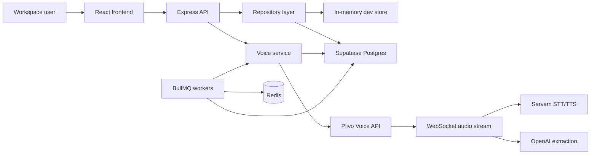

# BhaaratEngage

India-first outbound voice engagement platform for multilingual campaigns, structured data collection, follow-ups, compliance, and operational reporting.


## Overview

BhaaratEngage helps teams launch outbound calling campaigns that speak and understand Indian languages, collect structured information during calls, confirm sensitive answers, trigger follow-ups, and report on campaign outcomes.

The app is built as a full-stack TypeScript system:

| Layer | Purpose |
| --- | --- |
| Frontend | React, Vite, Tailwind, shadcn/ui-style components, React Query |
| API | Express, Zod contracts, role-based access, audit logging |
| Database | Supabase Postgres with tenant-owned tables, RLS policies, views, migrations |
| Voice runtime | Plivo outbound calls and streams, Sarvam STT/TTS, OpenAI extraction |
| Workers | BullMQ and Redis for dialer, journey follow-ups, and scheduler control |
| Testing | Vitest, Supertest, frontend route tests, backend service tests, Supabase integration harness |

## Product Capabilities

| Area | What is included |
| --- | --- |
| Campaigns | Builder, edit flow, launch, pause, resume, duplicate, soft delete, contact assignment |
| Contacts | CRUD, CSV import/export, do-not-call handling, campaign assignment |
| Voice agent | Outbound call creation, Plivo stream webhook, multilingual STT/TTS, field extraction, confirmation, transfer |
| Journeys | Retry and follow-up handling for unanswered and partial outcomes |
| Reports | Dashboard, provider health, dispositions, field dropoff, transfer queues, export paths |
| Security | Supabase JWT auth, roles, tenant scoping, RLS migrations, audit logs, secret redaction |
| Operations | Dialer eligibility, quiet hours, pacing, concurrency, scheduler auto-pause/resume |

## Architecture



The backend can run in two repository modes:

- `memory`: fast local development with seeded in-memory data.
- `supabase`: production-like persistence through Supabase.
- `auto`: uses Supabase when credentials are present, otherwise falls back to memory.

## Repository Layout

```text
.
|-- src/                         # React frontend
|   |-- components/              # App shell, auth guards, UI components
|   |-- hooks/                   # React Query and viewer hooks
|   |-- lib/                     # API client, contracts, auth, formatters
|   |-- pages/                   # Dashboard, campaigns, contacts, reports, settings
|   `-- test/                    # Frontend tests and mock API
|-- backend/
|   |-- src/
|   |   |-- modules/             # Domain modules: campaigns, contacts, voice, etc.
|   |   |-- repositories/        # In-memory and Supabase repository implementations
|   |   |-- routes/              # API and system routers
|   |   |-- config/              # Environment loader
|   |   `-- lib/                 # Logger, security, operational metrics
|   |-- workers/                 # Dialer, journey, scheduler workers
|   |-- supabase/migrations/     # Database schema and migration SQL
|   `-- tests/                   # Backend, worker, voice, Supabase integration tests
|-- wtask.md                     # Build tracker
`-- voice_agent_architecture.md  # Voice architecture notes
```

## Prerequisites

- Node.js 20 or newer
- npm
- Redis for workers
- Supabase project for persistent storage and auth
- Plivo account for telephony
- Sarvam API key for Indian language STT/TTS
- OpenAI API key for extraction

For local UI/API development, Supabase, Redis, Plivo, Sarvam, and OpenAI are optional if you use the in-memory backend mode.

## Quick Start

Install dependencies:

```bash
npm install
npm --prefix backend install
```

Create local env files:

```powershell
Copy-Item .env.example .env.local
Copy-Item backend/.env.example backend/.env.local
```

For a simple local run, set the backend to memory mode in `backend/.env.local`:

```env
BACKEND_DATA_SOURCE=memory
API_AUTH_MODE=disabled
```

Start the backend:

```bash
npm run backend:dev
```

Start the frontend in another terminal:

```bash
npm run dev
```

Open:

```text
http://localhost:8080
```

The frontend proxies `/api` requests to `http://localhost:4000`.

## Environment Files

Use `.env.local` files for real credentials. They are ignored by Git.

Frontend:

```text
.env.local
```

Common values:

```env
VITE_API_BASE_URL=http://localhost:4000
VITE_SUPABASE_URL=https://your-project-ref.supabase.co
VITE_SUPABASE_ANON_KEY=your-supabase-anon-key
```

Backend:

```text
backend/.env.local
```

Important values:

```env
PORT=4000
FRONTEND_ORIGIN=http://localhost:8080
BACKEND_DATA_SOURCE=auto
API_AUTH_MODE=supabase
SUPABASE_URL=https://your-project-ref.supabase.co
SUPABASE_SERVICE_ROLE_KEY=your-service-role-key
REDIS_URL=redis://localhost:6379
PUBLIC_BASE_URL=https://your-public-callback-host
PLIVO_AUTH_ID=your-plivo-auth-id
PLIVO_AUTH_TOKEN=your-plivo-auth-token
PLIVO_PHONE_NUMBER=your-plivo-number
SARVAM_API_KEY=your-sarvam-key
OPENAI_API_KEY=your-openai-key
SENSITIVE_DATA_ENCRYPTION_KEY=use-a-long-random-secret
```

Do not commit real keys. If a service-role key or personal access token is exposed, rotate it immediately.

## Supabase Setup

The database schema lives in:

```text
backend/supabase/migrations/
```

Migration files:

```text
0001_initial_schema.sql
0002_tenant_consistency_guards.sql
0003_add_in_progress_call_status.sql
0004_collected_data_unique_field_per_call.sql
0005_campaign_pause_mode.sql
```

After installing the Supabase CLI, link the project and push migrations:

```bash
npx supabase link --project-ref your-project-ref
npx supabase db push --linked --include-all
```

The CLI will need the remote Postgres database password. A Supabase anon key, service-role key, or personal access token is not the same thing as the database password.

Run the credentialed Supabase suite:

```bash
npm run backend:test:supabase
```

Or let the full check run it only when configured:

```bash
npm run backend:test:supabase:if-configured
```

## Voice Runtime

The voice path supports:

- Plivo outbound call creation
- Plivo answer and status webhooks
- Bidirectional Plivo audio stream
- Sarvam Saaras STT
- Sarvam Bulbul TTS
- OpenAI field extraction and confirmation logic
- PAN/Aadhaar-style alphanumeric normalization
- Sensitive value masking and encryption-aware persistence
- Human transfer when campaign transfer settings are enabled

For local webhook testing, expose the backend with a public HTTPS tunnel and set:

```env
PUBLIC_BASE_URL=https://your-public-host
```

In production, keep webhook signature validation enabled:

```env
PLIVO_VALIDATE_SIGNATURES=true
```

## Workers

Start Redis first, then run workers as separate processes:

```bash
npm --prefix backend run worker:dialer
npm --prefix backend run worker:journey
npm --prefix backend run worker:scheduler
```

Worker responsibilities:

| Worker | Responsibility |
| --- | --- |
| Dialer | Select eligible contacts, enforce DND, quiet hours, pacing, retry windows, and concurrency |
| Journey | Dispatch retry, SMS, WhatsApp, or no-op follow-up actions |
| Scheduler | Periodically enqueue work and auto-pause/resume campaigns around calling windows |

## Scripts

Root scripts:

| Command | Description |
| --- | --- |
| `npm run dev` | Start the frontend dev server |
| `npm run build` | Build the frontend |
| `npm run test` | Run frontend tests |
| `npm run lint` | Run ESLint |
| `npm run backend:dev` | Start the backend in watch mode |
| `npm run backend:test` | Run backend tests |
| `npm run backend:test:supabase` | Run live Supabase integration tests |
| `npm run backend:build` | Build the backend API |
| `npm run backend:workers:build` | Build worker entrypoints |
| `npm run check:all` | Run lint, tests, typechecks, and builds across the stack |

Backend-only scripts:

| Command | Description |
| --- | --- |
| `npm --prefix backend run dev` | Backend dev server |
| `npm --prefix backend run typecheck` | Backend TypeScript check |
| `npm --prefix backend run typecheck:workers` | Worker TypeScript check |
| `npm --prefix backend run test` | Backend Vitest suite |
| `npm --prefix backend run test:supabase` | Supabase-backed integration suite |
| `npm --prefix backend run build` | Compile backend API |
| `npm --prefix backend run build:workers` | Compile worker entrypoints |

## Testing Strategy

The project is covered at multiple levels:

- Frontend API client and route rendering tests
- Backend route tests with Supertest
- Service tests for campaigns, contacts, settings, call records, voice, journeys, workers
- Repository tests for in-memory behavior parity
- Supabase integration tests for real database-backed API paths
- End-to-end acceptance test for campaign creation, contact import, launch, call collection, confirmation, view, and export

Recommended release gate:

```bash
npm run check:all
```

For real database confidence:

```bash
npm run backend:test:supabase
```

## API Surface

Major route groups:

| Route group | Purpose |
| --- | --- |
| `/api/dashboard` | Workspace dashboard snapshot |
| `/api/campaigns` | Campaign CRUD, launch, pause, resume, duplicate, assignment |
| `/api/contacts` | Contact CRUD, import, export, do-not-call |
| `/api/call-records` | Calls, transcripts, collected data, recordings, export |
| `/api/journeys` | Journey monitoring and detail views |
| `/api/reports` | Reporting snapshots and exports |
| `/api/settings` | Workspace, team, webhooks, API keys, security controls |
| `/api/search/global` | Global app search |
| `/voice/*` | Plivo callbacks and stream endpoints |
| `/health`, `/ready` | System health checks |

## Security Notes

- Supabase JWT auth is supported through `API_AUTH_MODE=supabase`.
- Role middleware protects admin, manager, reviewer, operator, and viewer paths.
- Tenant isolation is enforced in repository access patterns and database migrations.
- RLS policies are included for tenant-owned tables.
- Sensitive collected values are encrypted before storage and masked separately for UI-safe views.
- Full transcript access is role and policy restricted.
- Pino logging redacts secret-bearing headers and payload fields.
- Audit logs cover launches, pauses, transfers, transcript access, exports, API key changes, and webhook changes.

## Troubleshooting

| Symptom | Likely fix |
| --- | --- |
| Supabase tests skip | Set `SUPABASE_URL`, `SUPABASE_SERVICE_ROLE_KEY`, and `SUPABASE_INTEGRATION_TEST=true` in `backend/.env.local` |
| `public.organizations` missing | Apply migrations in `backend/supabase/migrations` to the remote Supabase project |
| Backend falls back to memory | Set `BACKEND_DATA_SOURCE=supabase` and provide Supabase credentials |
| CORS errors | Ensure `FRONTEND_ORIGIN=http://localhost:8080` for local dev |
| Redis connection refused | Start Redis or point `REDIS_URL` at a reachable Redis instance |
| Plivo callbacks fail locally | Set `PUBLIC_BASE_URL` to a public HTTPS tunnel URL |
| Production boot fails on encryption | Set a strong `SENSITIVE_DATA_ENCRYPTION_KEY` |

## Current Release Focus

The core MVP is implemented across frontend, API, voice runtime, workers, and security hardening. The most important remaining release-validation work is:

- Run Supabase-backed integration tests after remote migrations are applied.
- Validate frontend pages against real Supabase-backed data with no fallback.
- Load test concurrent dialing and WebSocket voice streams.
- Defer standalone campaign field CRUD until the UI requires per-field editing.

## License

Private project. Add a license before publishing or distributing outside the workspace.
