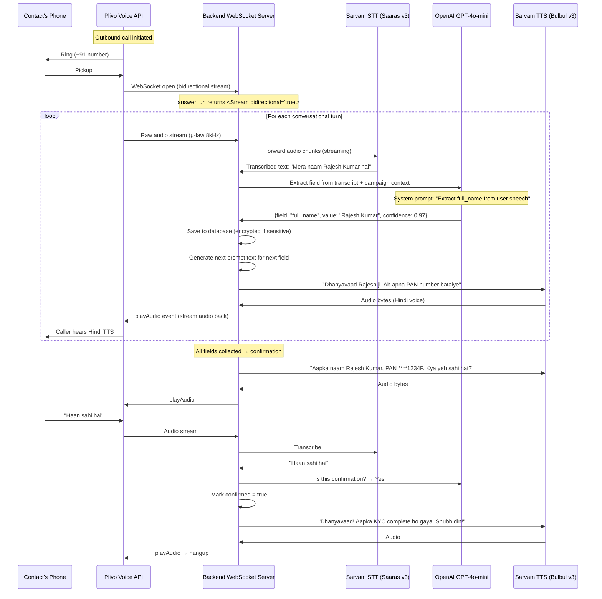
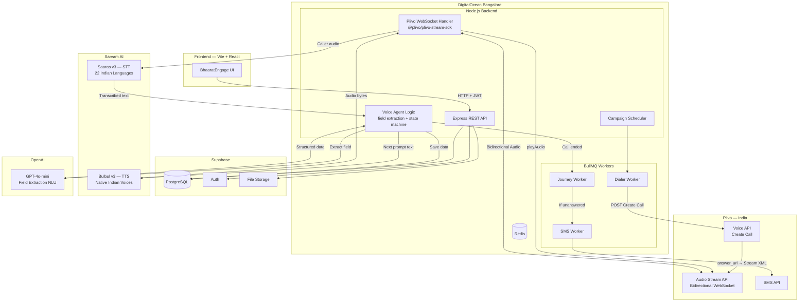

# BhaaratEngage — Indian Language Voice Agent Architecture

## The Problem

BhaaratEngage supports **8 Indian languages**: Hindi, English, Tamil, Telugu, Kannada, Bengali, Marathi, Gujarati. The voice agent must:

1. **Speak** naturally in all 8 languages (TTS)
2. **Understand** spoken responses in all 8 languages (ASR/STT)
3. **Handle code-switching** (e.g., "Mera PAN number hai ABCDE1234F" — Hindi mixed with English alphanumerics)
4. **Extract structured data** from freeform speech (NLU)
5. Work over **telephony** (noisy, 8kHz audio, dropouts)

---

## Key Discovery: Plivo + Sarvam AI (Official Integration)

After researching extensively, I found that **Plivo officially integrates with Sarvam AI** — an India-first AI company built specifically for Indian language speech. This changes our architecture significantly (for the better).

### What is Sarvam AI?
- India-first AI company focused on **22 scheduled Indian languages**
- **Saaras v3** — STT engine optimized for telephonic audio, code-switching, Indian accents
- **Bulbul v3** — TTS engine with natural-sounding Indian voices, emotional modulation
- Official integration with Plivo via **Audio Streaming API** + **Pipecat framework**
- Pay-as-you-go pricing in INR

### Why Not Just Use Plivo's Built-in ASR + Amazon Polly?

| Capability | Plivo Built-in (GetInput + Polly) | Plivo Stream + Sarvam AI |
|---|---|---|
| **Hindi** | ✅ Basic (Polly.Aditi) | ✅ Excellent native voices |
| **English (Indian)** | ✅ (Polly.Raveena/Kajal) | ✅ Indian-accented |
| **Tamil** | ⚠️ Limited/no native voice | ✅ Native Tamil voices |
| **Telugu** | ⚠️ Limited/no native voice | ✅ Native Telugu voices |
| **Kannada** | ❌ No Polly voice | ✅ Native Kannada voices |
| **Bengali** | ⚠️ Limited | ✅ Native Bengali voices |
| **Marathi** | ❌ No Polly voice | ✅ Native Marathi voices |
| **Gujarati** | ❌ No Polly voice | ✅ Native Gujarati voices |
| **Code-switching** | ❌ Not handled | ✅ Built for Hinglish, Tanglish etc. |
| **Telephony optimization** | Basic | ✅ Trained on 8kHz telephonic audio |
| **Latency** | ~500ms (webhook round-trip) | ~300ms (streaming WebSocket) |
| **Accuracy for Indian accents** | ~70-80% | ~90-95% |

> [!IMPORTANT]
> **Verdict**: Plivo's built-in ASR + Polly TTS only reliably covers **Hindi and English**. For all 8 languages, Sarvam AI is the clear winner — and Plivo officially supports this integration via their Audio Streaming API.

---

## Architecture: Plivo Stream + Sarvam AI + OpenAI



---

## How Plivo Audio Streaming Works

Instead of the webhook-per-turn approach (`<GetInput>` → callback → XML response → callback...), the **Stream API** opens a single persistent WebSocket for the entire call duration:

### 1. Answer URL returns Stream XML
```xml
<?xml version="1.0" encoding="UTF-8"?>
<Response>
    <Stream bidirectional="true" keepCallAlive="true" 
           contentType="audio/x-mulaw;rate=8000">
        wss://your-server.com/plivo-stream
    </Stream>
</Response>
```

### 2. Backend WebSocket Server (Node.js)
```typescript
import { PlivoWebSocketServer } from '@plivo/plivo-stream-sdk';

const plivoServer = new PlivoWebSocketServer({
  server: httpServer,
  path: '/plivo-stream',
  validateSignature: true,
  authToken: process.env.PLIVO_AUTH_TOKEN,
});

plivoServer.on('connection', (socket) => {
  // Initialize Sarvam STT + TTS streams for this call
  const sttStream = new SarvamSTTStream({ language: campaign.language });
  const ttsEngine = new SarvamTTSEngine({ voice: getVoiceForLanguage(campaign.language) });
  
  socket.on('start', (event) => {
    // Play intro prompt
    const introAudio = await ttsEngine.synthesize(campaign.intro_script);
    socket.send(JSON.stringify({ event: 'playAudio', media: { payload: introAudio } }));
  });

  socket.on('media', (event) => {
    // Forward caller audio to Sarvam STT
    const audioChunk = Buffer.from(event.media.payload, 'base64');
    sttStream.write(audioChunk);
  });

  sttStream.on('transcript', async (text) => {
    // Use GPT to extract field value
    const extraction = await extractField(text, currentField, campaign.language);
    
    if (extraction.confidence > 0.8) {
      await saveCollectedData(callRecordId, currentField, extraction.value);
      // Generate next field prompt
      const nextPrompt = getNextFieldPrompt(campaign, fieldIndex + 1);
      const audio = await ttsEngine.synthesize(nextPrompt);
      socket.send(JSON.stringify({ event: 'playAudio', media: { payload: audio } }));
    } else {
      // Retry: ask again with clarification
      const retryPrompt = `Maaf kijiye, kya aap dobara bata sakte hain apna ${currentField.label}?`;
      const audio = await ttsEngine.synthesize(retryPrompt);
      socket.send(JSON.stringify({ event: 'playAudio', media: { payload: audio } }));
    }
  });

  socket.on('stop', () => {
    // Call ended — trigger journey next step
    processCallEnd(callRecordId);
  });
});
```

---

## Language → Voice Mapping (Sarvam AI)

| Language | Sarvam STT Model | Sarvam TTS Voice | Code-switch Support |
|---|---|---|---|
| **Hindi** | `saaras-v3` (hi-IN) | `bulbul-v3` Hindi female/male | ✅ Hinglish |
| **English** | `saaras-v3` (en-IN) | `bulbul-v3` Indian English | ✅ Native |
| **Tamil** | `saaras-v3` (ta-IN) | `bulbul-v3` Tamil | ✅ Tanglish |
| **Telugu** | `saaras-v3` (te-IN) | `bulbul-v3` Telugu | ✅ Telugu+English |
| **Kannada** | `saaras-v3` (kn-IN) | `bulbul-v3` Kannada | ✅ Kanglish |
| **Bengali** | `saaras-v3` (bn-IN) | `bulbul-v3` Bengali | ✅ Benglish |
| **Marathi** | `saaras-v3` (mr-IN) | `bulbul-v3` Marathi | ✅ Marathi+English |
| **Gujarati** | `saaras-v3` (gu-IN) | `bulbul-v3` Gujarati | ✅ Gujarati+English |

> [!TIP]
> Sarvam's auto-language-detection can also be used when the contact's language is unknown — set language to `"unknown"` and Sarvam will detect automatically.

---

## Cost Per Call (Estimated)

For a typical **3-minute KYC verification call** with ~10 conversational turns:

| Component | Usage | Cost (INR) |
|---|---|---|
| **Plivo Voice** | 3 min outbound | ~₹2.3 ($0.009/min × 3) |
| **Sarvam STT** | ~90 sec caller audio | ~₹0.75 (₹30/hr) |
| **Sarvam TTS** | ~2000 chars synthesized | ~₹3.0 (₹15/10K chars) |
| **OpenAI GPT-4o-mini** | ~2000 tokens total | ~₹0.5 |
| **Total per call** | | **~₹6.5 (~$0.08)** |

At 50,000 calls/day (as shown on landing page): **~₹3.25L/day** ($3,900/day)

> [!NOTE]
> This is significantly cheaper than manual human agents (₹15-25 per call in Indian BPOs). The voice agent costs ~₹6.5 per completed call — a **60-75% cost reduction**.

---

## Alternative Providers Compared

| Provider | Indian Languages | STT Quality | TTS Quality | Code-switching | Telephony Optimized | Plivo Integration | Cost |
|---|---|---|---|---|---|---|---|
| **Sarvam AI** | 22 languages | ⭐⭐⭐⭐⭐ | ⭐⭐⭐⭐⭐ | ✅ Native | ✅ | ✅ Official | ₹30/hr STT |
| **Google Cloud** | 5-6 languages | ⭐⭐⭐⭐ | ⭐⭐⭐⭐ | ⚠️ Partial | ⚠️ Generic | ❌ Custom | $0.016/min STT |
| **Gnani.ai** | 10+ languages | ⭐⭐⭐⭐⭐ | ⭐⭐⭐⭐ | ✅ | ✅ | ❌ Custom | Enterprise pricing |
| **Reverie** | 11+ languages | ⭐⭐⭐⭐ | ⭐⭐⭐⭐ | ✅ | ✅ | ❌ Custom | Enterprise pricing |
| **Amazon Polly** | 2 (Hindi, English) | N/A (TTS only) | ⭐⭐⭐ | ❌ | ⚠️ | ✅ Built-in | $4/1M chars |

> [!IMPORTANT]
> **Recommendation: Sarvam AI** — It's the only provider that has an **official Plivo integration**, covers all 22 Indian languages, handles code-switching natively, and has pay-as-you-go INR pricing perfect for an MVP.

---

## Updated Architecture Diagram



---

## Implementation Approach (Revised)

### Phase 1: Simple GetInput Flow (Week 3)
Start with Plivo's built-in `<GetInput>` + `<Speak>` for **Hindi and English only**:
- Faster to build and test
- Validates the end-to-end call flow
- Uses Polly.Aditi (Hindi) and Polly.Raveena (English)

### Phase 2: Upgrade to Sarvam AI Stream (Week 4-5)
Replace the GetInput flow with the full streaming architecture:
- Install `@plivo/plivo-stream-sdk`
- Set up Sarvam AI account and API keys
- Build the bidirectional WebSocket handler
- Implement STT → GPT → TTS pipeline
- Enable all 8 languages
- Implement barge-in (user interrupts bot speaking)

This two-phase approach lets us **ship a working demo in Week 3** while building toward the production-grade multilingual agent.

---

## Open Questions

> [!IMPORTANT]
> 1. **Sarvam AI account**: We need to sign up at console.sarvam.ai. Their Starter plan appears to be pay-as-you-go with free initial credits. Want me to factor this into Phase 1?
> 2. **Voice gender preference**: Sarvam offers male and female voices per language. Should campaigns have a configurable "bot voice gender" option?
> 3. **Language auto-detection**: Should the bot auto-detect the caller's language (Sarvam supports this), or always use the language set in the campaign config?
